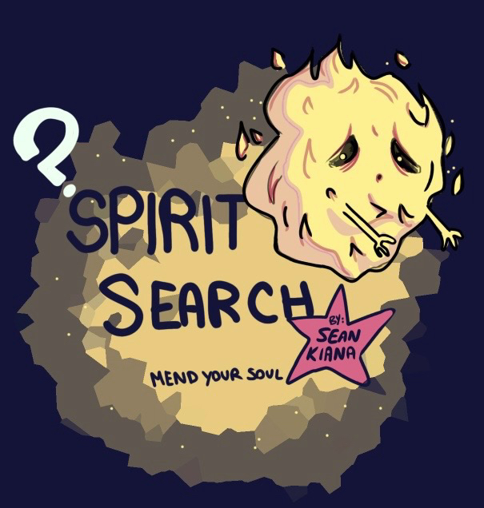

# 🌌 ["Spirit Search - Final Project CART 263"](https://seanhub-13.github.io/final-project-gitrepo/)

****

**Discover the afterlife! But first—make sure your soul is complete.**  
_Recollect aspects of your spirit, piece by piece, as you journey through a world shaped by ancient wisdom._

**Inspired by:**  
- 🐉 Chinese Philosophy  
- 🔥 Zoroastrian Cosmology  
- 🐫 Ancient Egyptian Conceptions of the Soul  

---

## 🏞️ The Journey

In *Spirit Search*, the soul arrives in the afterlife fragmented.  

To move forward, you must recover the essential aspects of the self:

- **Khet** – The physical form  
- **Ren** – The name and identity  
- **Sekhem** – The life force  

Each level presents a new fragment of the soul. Only once they are reunited can you ascend beyond the veil.

---

## 🎮 Controls

→ **Arrow Keys** - Move your character  
→ **E** - Interact with objects and the world  
→ **R** - Next text (Where applicable)  
→ **X** - Instructions show / hide  
→ **Portals** - Enter the next level / return to a previous one  

---

## 📜 Credits

This project uses [phaser.js](https://phaser.io/).

Programming by Sean Verba and Kiana Rezaee

Game Design by Sean Verba and Kiana Rezaee

Art by Kiana Rezaee

---

## ✏️ Attributions
["Let the Mystery Unfold"](https://pixabay.com/music/fantasy-dreamy-childrens-let-the-mystery-unfold-122118/) by user geoffharvey, licensed with a CC0 license

["Riser Hit sfx 001"](https://pixabay.com/sound-effects/riser-hit-sfx-001-289802/) by user AudioPapkin, licensed with a CC0 license

["Rumble · fade out 10s"](https://pixabay.com/sound-effects/rumble-fade-out-10s-85243/) by user freesound_community, licensed with a CC0 license

Read further about Pixabays licensing terms on https://pixabay.com/service/license-summary/